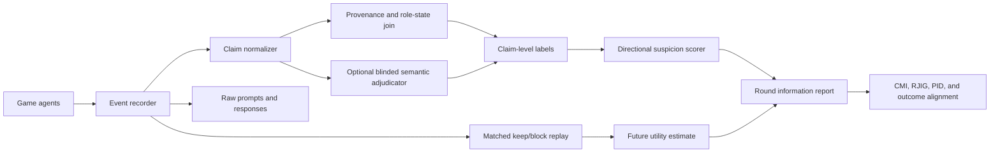

# Roundwise Outcome-Aligned Information in Werewolf Arena

## 1. Direct answer

### Have we already implemented a clear information-theoretic metric?

No. The current codebase does **not** compute mutual information, conditional mutual information, partial information decomposition (PID), or synergy.

The current implementation measures useful but different quantities:

- evidence coverage and evidence correctness;
- repeated or echoed evidence;
- message anchoring;
- round-level utility;
- extraction coverage, extraction fidelity, and cross-round reuse.

The existing `OUTCOME_ALIGNED_EXPERIMENT_PIPELINE.md` contains a useful PID/TDMI proposal sketch, but it does not yet fix the complete estimand, the discrete variables, the data table, the estimator, the null tests, or the round-level implementation. Therefore, we should not describe the repository as already having a clear positive-information metric.

The attached paper is a good methodological starting point. It measures whether the joint state of multiple agents predicts a future group state beyond what individual agent states predict. However, its synergy measure is a **predictive structural diagnostic**, not by itself a causal or performance guarantee. In our setting we should report predictive information, irreducibly joint information, and the downstream utility effect as separate quantities.

## 2. What the attached paper actually measures

The paper's main pairwise decomposition uses two current agent variables, `X_i,t` and `X_j,t`, and a future joint target `T_ij,t+ell`:

```text
I({X_i,t, X_j,t}; T_ij,t+ell)
  = Unique_i + Unique_j + Red_ij + Syn_ij
```

The interpretation is:

- `Unique_i`: information about the future target available from agent `i` but not agent `j`;
- `Unique_j`: the corresponding information for agent `j`;
- `Red_ij`: information available from either source because it is duplicated;
- `Syn_ij`: information available from the pair jointly but not recoverable from either source alone.

The paper treats positive `Syn_ij` as evidence that the pair contains predictive information that is irreducibly joint. It aggregates the median pairwise value across agent pairs rather than attempting to force a single whole-system PID decomposition.

It also discusses two useful extensions:

```text
S_macro(ell) = I(V_t; V_t+ell) - sum_k I(X_k,t; V_t+ell)
```

This is a coarse macro-level screen. A positive value suggests that the macro group state has more self-predictive information than the sum of the individual-source terms. It is not a complete PID identity: redundancy can make it negative even when higher-order synergy exists.

For a three-agent coalition, the paper gives a pair-versus-triplet diagnostic:

```text
I3 = I((X_i,t, X_j,t, X_k,t); V_t+ell)
G3 = I3 - max(I2_{i,j}, I2_{i,k}, I2_{j,k})
```

Positive `G3` means that no pair captures all of the triplet's predictive information. This is useful as a secondary diagnostic, but it is not necessary for the first Werewolf experiment.

The paper also makes several limitations important for our proposal:

1. Positive synergy does not prove that the group beats a single agent or that a task metric improves.
2. Synergy and redundancy are endogenous to the evolving trajectory; episode length can confound them.
3. Finite-sample mutual-information estimates are biased and can become unstable with high-cardinality variables.
4. Early fixed horizons are preferable to comparing arbitrary late rounds after some episodes have already ended.
5. Row-wise and time/block shuffles are needed to distinguish genuine cross-agent temporal coupling from marginal structure.

## 3. Research objective in our context

The first question for our Werewolf benchmark should be:

> After conditioning on the public history, does the pooled private information of good agents contain predictive information about the next correct game-relevant decision that no single good agent contains alone, and does exposing that information change future team utility?

This separates three claims that should not be conflated:

1. **Information:** a group state predicts a future fact or decision.
2. **Synergy:** the prediction requires combining information from multiple agents.
3. **Outcome alignment:** using or exposing that information causes better downstream utility.

The primary analysis should use the good-agent coalition because the scientific question is whether task-relevant, complementary information helps the villagers. The all-agent coalition can be reported as a secondary, adversarial diagnostic, but it should not replace the good-only estimand because wolf information has a different objective and can be strategically misleading.

## 4. Proposed metric family

### 4.0 What “positive information” means here

The word **positive** needs to be defined more carefully than “the message does not contradict the fact that at least one wolf exists.” That condition is too weak: almost every ordinary Werewolf conversation satisfies it.

For the controlled positive-information benchmark, use two primary requirements and one separate strategic label:

1. **Task-relevant non-misleading:** the conversation does not falsely identify a known good agent as a wolf, fabricate wolf evidence, or misattribute evidence in a way that logically implicates a good agent. This requirement applies to wolf-status information, not to truthful disclosure of every private role.
2. **Wolf-directed:** the information increases suspicion of at least one actual wolf, decreases suspicion of good agents, or narrows the candidate set in a way that favors actual wolves. This is a stronger, directional requirement than merely being compatible with the game state.
3. **Role concealment:** a good agent may hide or strategically misrepresent their own role, for example by claiming to be the Seer to protect the real Seer. This is logged separately as role-identity deception and is not automatically a violation of positive information.

Thus, the first experiment should define positive task information as **task-relevant non-misleading plus wolf-directed**, while allowing strategic role concealment. We should still validate verifiable evidence claims against the hidden state, but we should not require every speaker to reveal their true role or every truthful clue to logically prove that a particular player `j` is a wolf. A fake Seer claim can be acceptable under this definition if it does not falsely attribute wolf evidence to a good player and its task-relevant content points toward actual wolves.

Mutual information cannot enforce this definition by itself. MI is unsigned: a source can predict the hidden role label while moving suspicion in the wrong direction. Positivity therefore requires evidence-level validation plus a directional suspicion metric.

For a candidate `j`, let `q_B(j)` be the suspicion score before the selected information is exposed and `q_G(j)` the score after the pooled good-agent information is exposed. These can be calibrated probabilities if the system supplies them, or a pre-registered ordinal/rank score if it does not. Report:

```text
RoleDirectionalGain_r
  = mean_{j in wolves} DeltaScore_r(j)
    - mean_{j in good agents} DeltaScore_r(j)

GoodFalsePositiveRate_r
  = mean_{j in good agents} 1{DeltaScore_r(j) > 0}
```

For the strict controlled evidence intervention, require `DeltaScore_r(j) <= 0` for every known good agent whenever the intervention is intended to be non-misleading. In the open-conversation condition, role concealment may change how agents perceive the speaker; report `GoodFalsePositiveRate` rather than assuming that strategic bluffing has no side effects. A positive `RoleDirectionalGain` is the desired directional result; low false-positive suspicion remains an important outcome guardrail.

### 4.1 Round-level variables

For episode `e` and round `r`, define the following structured random variables. These variables are intentionally discrete and auditable; raw conversation text and embeddings should not be used for the first estimator.

```text
B_e,r       public baseline available before the round's decision
X_i,e,r     private structured information available to good agent i
X_G,e,r     pooled private information from all good agents
Y_e,r+1     next hidden-state or decision target
U_e,r+1     downstream team utility after the next decision
```

`B_e,r` should include only information that every relevant agent could access at that point:

- round index and current phase;
- living-player set;
- public evidence IDs and whether an item is new or repeated;
- previous public claims, votes, eliminations, and night removals;
- public role claims and other structured public state;
- the current condition and model block, when used as a stratification variable rather than as information available to agents.

`X_i,e,r` should include information available to agent `i` but not necessarily to the other good agents:

- private evidence IDs and evidence-role labels;
- the IDs of public messages that the agent extracted or relied on;
- a discretized top suspected candidate;
- a discretized confidence bin, for example `low`, `medium`, or `high`;
- whether the top suspected candidate changed after the round;
- an optional discretized belief vector over living players, included only after the smaller representation is stable.

`X_G,e,r` is the canonicalized union of the good agents' private evidence and extracted claims. The union must preserve provenance and must not include information generated after the target decision. Duplicate evidence should have one canonical ID plus a count or source mask, rather than being silently counted as multiple independent facts.

### 4.2 Future targets

We should estimate information about two targets separately.

**Role-state target:** for each candidate `j`,

```text
Y_fact(e,r,j) = 1{j is a werewolf in the hidden episode state}
```

This is the ground-truth role label, not a label saying that a message is positive. It lets us measure whether a source predicts the role assignment, but it does not say whether the source is task-relevant non-misleading, wolf-directed, or strategically useful. Those properties require the evidence contract, role-concealment annotations, and suspicion-change metrics above.

**Decision target:**

```text
Y_decision(e,r) = the next public candidate selected for exile
                  or the next structured decision outcome
```

For stable estimation, use a fixed candidate-level table: one row per living candidate with a binary target indicating whether that candidate is the correct wolf target. This avoids mixing a variable-size categorical action with role changes across episodes.

The primary report should use an early fixed horizon, such as the end of round `0` and round `1`. We should not average over all available rounds without accounting for censoring because successful and unsuccessful episodes can end at different times.

### 4.3 Conditional mutual information

For an individual good agent and the pooled good coalition, estimate:

```text
I_i,r = I(Y_r+1; X_i,r | B_r)
I_G,r = I(Y_r+1; X_G,r | B_r)
```

These quantify predictive information about the next target after conditioning on public history. They are not yet causal effects and are not automatically beneficial.

They are also not directional. For example, information that consistently makes a good agent look suspicious can still have nonzero MI with the role label. Therefore, every MI result should be accompanied by `RoleDirectionalGain`, `GoodFalsePositiveRate`, and evidence-level compatibility checks.

### 4.4 Primary joint-information metric

Define the **Roundwise Joint Information Gain** (RJIG) as:

```text
RJIG_r = I_G,r - max_i I_i,r
```

Interpretation:

- `RJIG_r > 0`: pooled good-agent information predicts the target beyond the best individual good agent;
- `RJIG_r = 0`: the best individual already captures the available predictive information;
- `RJIG_r < 0` in a sample: likely estimator noise, finite-sample bias, support mismatch, or an implementation problem, because the population difference cannot be negative when `X_i` is a component of the pooled source and the comparison is defined consistently.

RJIG is the simplest primary metric for our benchmark because it answers “does combining good agents add predictive information beyond the best single good agent?” It should not be called pure PID synergy. It is a joint-gain contrast and is easier to estimate and explain than a many-source PID.

RJIG still does not establish that the information points toward the wolves. A positive RJIG must be interpreted jointly with the task-relevant non-misleading and wolf-directed criteria, role-concealment annotations, and `RoleDirectionalGain` when suspicion scores are available.

### 4.5 Pairwise PID synergy diagnostic

For each pair of good agents, use a common target `Y` and compute:

```text
I((X_i,r, X_j,r); Y_r+1 | B_r)
  = Unique_i,r + Unique_j,r + Red_i,j,r + Syn_i,j,r
```

The proposed PID summaries are:

```text
PID-Syn_r = median_{i<j, good} Syn_i,j,r
PID-Red_r = median_{i<j, good} Red_i,j,r
```

Use Williams-Beer PID with `I_min` redundancy as the primary estimator and MMI redundancy as a sensitivity analysis. The choice of redundancy function must be recorded in every output file.

This diagnostic is closer to the attached paper's definition of irreducibly joint information, but it has a narrower interpretation than RJIG. PID-Syn can be positive while the group still makes worse decisions, for example when the group jointly infers a true but strategically unhelpful fact, anchors on a true low-value clue, or spends communication budget in a way that harms later play.

### 4.6 Outcome-aligned quantities

Use a separately randomized intervention to estimate whether the information helps the team. Let `U_future` be utility from the next decision through the end of a fixed evaluation window:

```text
DeltaU_r = E[U_future | selected public information kept]
          - E[U_future | selected public information blocked or replaced]
```

The intervention must change only the selected information channel while keeping roles, seed, model, public history, token budget, and randomization protocol matched as closely as possible.

Define the descriptive outcome-aligned score:

```text
ROAIG_r = RJIG_r * DeltaU_r
```

Also report the unclipped components and, only as a descriptive summary,

```text
ROAIG_positive_r = RJIG_r * max(DeltaU_r, 0)
```

The interpretation is deliberately two-dimensional:

| Information result | Intervention result | Interpretation |
|---|---|---|
| `RJIG > 0` | `DeltaU > 0` | useful joint information |
| `RJIG > 0` | `DeltaU < 0` | joint information exists but its integration is harmful |
| `RJIG <= 0` | `DeltaU > 0` | useful information is not irreducibly joint under this representation |
| `RJIG <= 0` | `DeltaU <= 0` | no evidence of useful added information |

ROAIG is not a replacement for the causal utility estimate. The paper's information metric and our outcome-aligned extension answer different questions, so the report must display `RJIG`, `PID-Syn`, and `DeltaU` separately.

For a simple utility definition in the initial experiment, use:

```text
U_day = +1  correct werewolf exile
         -1  good-agent exile
          0  no majority or no decision
```

Later analyses can use eventual village win, but early-round utility should be preferred for identifying the local effect of one information channel.

## 5. Estimation protocol

### 5.1 Small discrete representations first

Start with low-cardinality variables:

- evidence mask or evidence count;
- top suspected candidate;
- confidence bin;
- new-versus-repeated evidence indicator;
- correct-versus-incorrect candidate target.

Do not estimate MI directly from raw text, raw model log probabilities, or unconstrained embeddings in the first version. Those representations make the estimator difficult to audit and create severe support sparsity.

### 5.2 Avoid leakage and temporal confounding

At round `r`, include only observations available before the target decision. Do not use the agent's later vote, later private summary, eventual winner, or messages from future rounds to form `X_i,r`.

Use fixed early horizons (`r=0`, `r=1`) as the primary analysis. A late-round analysis can be exploratory, with an explicit at-risk indicator and inverse-probability-of-censoring weights if needed.

### 5.3 Bias, uncertainty, and train/test separation

The estimator should:

- fit quantile bins and category vocabularies on training episodes only;
- use Jeffreys smoothing or Miller-Madow correction for discrete entropy terms;
- report the number of episodes and rows supporting every estimate;
- bootstrap at the episode level, never at individual rows only;
- use held-out episodes for the confirmatory estimate;
- preserve condition, model, and seed-block identifiers.

Because the same episode contributes multiple candidates and rounds, confidence intervals must cluster by episode. Candidate-level rows are not independent observations.

### 5.4 Null and falsification tests

At minimum, run these controls:

1. **Agent-identity shuffle:** shuffle source-agent identities within the matched stratum while preserving marginal source distributions.
2. **Time/block shuffle:** break cross-agent temporal coupling while preserving local temporal structure.
3. **Private-source ablation:** remove the selected private evidence from the pooled source and confirm that the estimated information changes as expected.
4. **Public-only baseline:** estimate `I(Y; B)` and verify that the private-information result is not merely a public-history artifact.

Report observed minus the median null estimate, with a bootstrap interval. A positive uncorrected estimate is not enough evidence of coordination.

## 6. Coding plan

### 6.1 Extend the structured extraction schema

Add a compact, machine-validated representation to each `RoundExtractionEvent`:

```json
{
  "source_message_ids": ["m_001", "m_004"],
  "evidence_refs": ["E2", "E5"],
  "hypotheses": [
    {"candidate": "Bert", "wolf_probability_bin": "high"},
    {"candidate": "Jacob", "wolf_probability_bin": "low"}
  ],
  "role_claim": {
    "claimed_role": "seer",
    "is_role_concealment": true
  },
  "wolf_status_claims": [
    {"candidate": "Bert", "evidence_refs": ["E2"], "claim_type": "wolf"}
  ],
  "top_candidate": "Bert",
  "confidence_bin": "high",
  "top_candidate_changed": true
}
```

The parser should reject unknown candidates, future message IDs, and unsupported categories. `is_role_concealment` is an analysis annotation and must not be treated as proof that the message is harmful. The hidden-role join should separately label whether a wolf-status claim is false, unsupported, or directed toward an actual wolf. Keep the original extraction text for auditability, but use the structured fields for estimation.

### 6.2 Write a round-snapshot artifact

Add one JSONL record per episode and analysis round, for example `information_snapshots.jsonl`:

```json
{
  "episode_id": "C1_seed_1001",
  "condition_id": "C1",
  "seed": 1001,
  "round": 0,
  "good_agents": ["Jacob", "Scott", "Sam", "Tyler"],
  "public_baseline": {},
  "agent_sources": {},
  "pooled_good_source": {},
  "target": {},
  "future_utility": 1.0,
  "censored": false
}
```

The snapshot is the analysis contract. It should make it possible to recompute metrics without replaying the language-model calls.

### 6.3 Proposed modules and changes

Add:

```text
experiment/information_snapshots.py
experiment/information_metrics.py
experiment/analyze_information.py
```

Modify only the event/logging boundaries needed to populate those artifacts:

```text
experiment/events.py
experiment/metrics.py
werewolf/game.py
werewolf/model.py
werewolf/prompts.py
werewolf/runner.py
```

The first implementation should expose pure functions with explicit inputs and metadata:

```text
conditional_mutual_information(rows, source, target, conditioning, estimator_config)
joint_information_gain(rows, pooled_source, individual_sources, target, conditioning)
pid_two_source(rows, source_i, source_j, target, conditioning, redundancy="imin")
roundwise_information(snapshot_rows, round_index, target_kind)
outcome_aligned_information_gain(kept_rows, blocked_rows, utility_column)
permutation_null(snapshot_rows, null_kind, n_permutations, seed)
```

Every function should return the estimate in bits together with:

- target type and horizon;
- round index;
- conditioning variables;
- source representation version;
- estimator and smoothing settings;
- sample size and episode count;
- null procedure and permutation seed;
- censoring rule;
- confidence interval or bootstrap summary.

### 6.4 Recommended implementation order

1. Implement entropy and conditional-MI unit tests on small synthetic tables.
2. Implement RJIG before PID because it is the primary and simpler estimand.
3. Implement pairwise PID as a diagnostic with two redundancy estimators.
4. Add round-snapshot generation and schema validation.
5. Analyze historical runs without making new API calls.
6. Add intervention replay only after the observational metrics and leakage checks pass.

### 6.5 Evaluator architecture: do we need a separate determining agent?

**Short answer:** a separate evaluator is useful for free-form language, but it should not be the sole authority for whether information is positive. The first implementation should use a hybrid architecture:

- deterministic simulator state and evidence provenance for ground truth;
- structured claim extraction for each message or extraction event;
- an optional blinded LLM adjudicator only for ambiguous semantic entailment;
- deterministic role-direction and utility calculations from structured suspicion scores and matched interventions.

The evaluator must run offline after the game. It must never send feedback to the game agents or change the game trajectory.



#### Component 1: event recorder

The live game records raw messages, structured evidence references, role claims, extraction events, public history, and pre-decision snapshots. The recorder does not interpret whether a claim is good or bad. This keeps the game trace auditable and prevents evaluator logic from affecting agent behavior.

#### Component 2: claim normalizer

Convert every eligible message into atomic records such as:

```json
{
  "message_id": "m_004",
  "speaker": "Jacob",
  "claim_type": "wolf_status",
  "candidate": "Bert",
  "evidence_refs": ["E2"],
  "claimed_role": null,
  "claim_strength": "moderate",
  "source_span": "Bert is most likely a wolf because..."
}
```

Prefer structured claims emitted by the existing extraction prompt. If the raw message contains claims that the extractor cannot parse, place them in an `ambiguous` queue rather than silently discarding them.

#### Component 3: deterministic provenance and hidden-state join

This component can see the simulator's hidden roles and evidence catalog, but it runs only offline. It should determine:

- whether each cited evidence reference exists;
- whether the evidence reference was available to the speaker;
- whether an evidence claim is factually correct under the episode state;
- whether a wolf-status claim names an actual wolf or a good agent;
- whether a claim misattributes evidence to a good agent;
- whether a role claim is a concealment or a truthful role disclosure.

This is the authoritative source for ground-truth matching. It should be implemented with rules and joins, not an LLM. A villager claiming to be the Seer is recorded as `role_concealment=true`; that fact alone does not make the message misleading.

#### Component 4: optional blinded semantic adjudicator

Use a separate LLM evaluator only when the text's logical implication cannot be recovered from structured fields. It should receive:

- the atomic claim or short message;
- the public history available at that time;
- the referenced evidence definitions;
- the candidate list;

It should not receive hidden roles when deciding what the claim means. Its output should be strict JSON:

```json
{
  "implied_wolf_candidates": ["Bert"],
  "implied_good_candidates": [],
  "evidence_attributions": [{"candidate": "Bert", "evidence_refs": ["E2"]}],
  "role_identity_claim": "seer",
  "role_identity_concealment_possible": true,
  "entailment_strength": "moderate",
  "ambiguity": "low"
}
```

Run two independent adjudications for ambiguous claims, record the model, prompt version, temperature, and agreement, and manually audit a fixed sample. Do not use the evaluator's free-form narrative as the final label. If agreement is low, mark the claim unresolved instead of forcing a positive or negative label.

#### Component 5: claim-level labels

After joining the semantic output with hidden-state truth, assign mutually interpretable labels:

```text
non_misleading = no false wolf-status implication
                  and no false or misattributed wolf evidence

wolf_directed = directional score favors actual wolves over good agents
                or a valid claim narrows suspicion toward actual wolves

role_concealment = speaker hides or strategically misstates own role

positive_task_info = non_misleading AND wolf_directed
neutral_task_info  = non_misleading AND NOT wolf_directed
misleading_info    = NOT non_misleading
unresolved         = insufficient evidence or semantic adjudicator disagreement
```

The `neutral` category is important. Not every useful conversation sentence will be wolf-directed, and forcing every sentence into “positive” would inflate the metric. Role concealment may coexist with any of these labels; it is a separate strategic feature rather than an automatic failure.

#### Component 6: directional suspicion scorer

Do not ask an LLM judge to decide whether a message was helpful by reading the final game outcome. That would mix semantic scoring, directionality, and hindsight. Instead, obtain a structured pre/post suspicion representation:

```text
q_before(j) = suspicion score for candidate j before the selected information
q_after(j)  = suspicion score after the selected information
DeltaScore(j) = q_after(j) - q_before(j)
```

If agents do not produce calibrated probabilities, use a fixed ordinal mapping from their ranked candidates and confidence bins. Treat this as a measurement scale, not as a calibrated probability. The primary directional summaries are:

```text
RoleDirectionalGain
  = mean DeltaScore(actual wolves)
    - mean DeltaScore(good agents)

GoodFalsePositiveRate
  = fraction of good candidates whose suspicion increases
```

For stronger causal evidence, compute these changes under matched `KEEP` versus `BLOCK` replays. The blocked replay estimates what the downstream agents would have suspected without the selected information; it is more informative than simply comparing the beginning and end of an uncontrolled conversation.

#### Component 7: round-level fusion

The final round report should not collapse everything into one LLM-generated score. It should include:

```text
claim_non_misleading_rate
claim_wolf_directed_rate
role_concealment_rate
RoleDirectionalGain
GoodFalsePositiveRate
RJIG
PID-Syn
DeltaU
```

The recommended interpretation is:

- high non-misleading rate and high wolf-directed rate: the communication channel contains the intended positive task information;
- high RJIG but low wolf-directedness: agents jointly share predictive structure, but it is not pointed in the desired direction;
- high wolf-directedness but negative `DeltaU`: the information points toward wolves but is integrated poorly or arrives at a harmful time;
- role concealment with positive task information: strategic identity hiding is compatible with the proposed definition;
- high good false-positive rate: the communication is operationally misleading even if individual evidence claims are factually correct.

This design answers the “separate determining agent” question directly: use a separate semantic evaluator as a bounded parser/adjudicator for ambiguous language, but keep truth matching, role labels, directionality, and utility outside that evaluator.

### 6.6 Signed task-information score

The proposed scoring rule is reasonable as a human-interpretable **task-alignment score**:

```text
score(c) = +1.00   positive_task_info
           +0.25   neutral_task_info
           -1.00   misleading_info
            NA     unresolved or role-identity-only claim
```

Here, `positive_task_info` means task-relevant non-misleading plus wolf-directed. `neutral_task_info` means non-misleading but not demonstrably wolf-directed. `misleading_info` means a false or misattributed wolf-status implication, especially one that points suspicion toward a good agent. A role-only claim such as “I am the Seer” should not receive `-1` merely because it is a strategic bluff; it should be marked as role concealment and scored through its task-relevant claims and downstream effects.

#### Aggregation

Score atomic task claims first, then aggregate without rewarding verbosity or repeated claims:

```text
score(message) = mean(score(c) for eligible atomic claims c in message)

score(round) = mean(score(message) for eligible messages in the round)
```

Use equal message weights as the primary analysis so that one long response does not dominate the round. Report a secondary evidence-weighted analysis if needed. Deduplicate repeated evidence IDs before computing the secondary score.

Always report the signed score together with its components:

```text
positive_rate
neutral_rate
misleading_rate
unresolved_rate
role_concealment_rate
signed_task_information_score
```

The component rates are necessary because the same mean score can result from very different communication patterns. For example, many neutral claims can mask a small but important number of misleading claims.

#### Sensitivity and interpretation

The values `+1`, `+0.25`, and `-1` should be fixed before looking at outcomes. The `0.25` value expresses mild credit for truthful, non-misleading information that is not directionally diagnostic; it is a design choice, not a quantity derived from information theory. Repeat the analysis with neutral weights `0` and `0.5` as sensitivity checks. If the conclusion changes, report that the result is weight-sensitive.

This score should not replace `RJIG`, `PID-Syn`, or `DeltaU`:

```text
signed_task_information_score = semantic and directional quality
RJIG / PID-Syn                   = predictive joint-information diagnostics
DeltaU                           = intervention-based downstream utility effect
```

The signed score can be used to test whether higher-quality information correlates with better offline performance, but its weights do not guarantee a positive relationship. That relationship must still be estimated on held-out episodes and tested against matched interventions.

### 6.7 Information estimates for positive, neutral, and misleading claims

The signed labels should organize the information analysis, but they should not be multiplied directly into raw MI. Mutual information is nonnegative and unsigned, so a misleading claim can have high MI if it consistently predicts a role while pointing suspicion in the wrong direction.

Let `L_c` be the claim label:

```text
L_c in {positive_task_info, neutral_task_info, misleading_info, unresolved}
```

For each label `l`, define a source channel `X^(l)_r` containing the structured claims with that label at round `r`. Estimate the following descriptively:

```text
I_group^(l)(r) = I(Y_r+1; X_G,r^(l) | B_r)
I_best^(l)(r)  = max_i I(Y_r+1; X_i,r^(l) | B_r)
RJIG^(l)(r)    = I_group^(l)(r) - I_best^(l)(r)
```

For pairs of good agents, also estimate:

```text
PID-Syn^(l)(r) = median_{i<j, good} Syn_i,j,r^(l)
```

Interpret these as label-stratified predictive diagnostics:

| Claim class | Possible information result | Directional interpretation |
|---|---|---|
| positive | CMI, RJIG, or PID-Syn can be positive | should also have positive directional information |
| neutral | CMI or RJIG may still be positive | information is truthful/non-misleading but not clearly wolf-directed |
| misleading | CMI or RJIG may still be positive | information predicts structure but points suspicion toward good agents or away from wolves |

The label-stratified estimates are useful for explanation, but they are not automatically causal. Because the label may use hidden roles, conditioning on `L_c` can introduce selection bias. The primary confirmatory analysis should therefore define the information channel before the outcome intervention, use held-out episodes, and treat label-stratified CMI/PID as a secondary decomposition.

#### Signed directional information in bits

To measure whether the information points in the desired direction, use a fixed reference belief model trained on separate episodes. Let:

```text
q_B(j)  = P_ref(j is a wolf | public baseline B)
q_Bc(j) = P_ref(j is a wolf | B and claim c)
```

For claim `c`, define the **Directional Role Information Gain**:

```text
DRIG(c)
  = mean_{j in actual wolves}
      log2(q_Bc(j) / q_B(j))
    - mean_{j in good agents}
      log2(q_Bc(j) / q_B(j))
```

Use probability clipping or smoothing before taking logarithms. `DRIG(c) > 0` means the claim moves predictive probability toward actual wolves relative to good agents. `DRIG(c) < 0` means it moves in the wrong direction. If the reference model is replaced by the actual agents' ranked suspicion output, call the result a behavioral directional score rather than a calibrated probability-based information measure.

The expected log-ratio form is information-theoretic in the sense that it is measured in bits, while its subtraction across actual wolves and good agents gives it the direction that ordinary MI lacks. Unless `P_ref` is calibrated or estimated nonparametrically from held-out data, call `DRIG` a **model-based directional log-information score**, not pure mutual information. It should be reported with:

```text
GoodFalsePositiveRate
mean DRIG for positive claims
mean DRIG for neutral claims
mean DRIG for misleading claims
```

Expected pattern:

```text
positive claims  : DRIG > 0, low GoodFalsePositiveRate
neutral claims   : DRIG approximately 0, nonnegative evidence validity
misleading claims: DRIG < 0 or elevated GoodFalsePositiveRate
```

#### Do not form a weighted MI sum

Avoid defining the primary information metric as:

```text
I_positive + 0.25 * I_neutral - I_misleading
```

That expression mixes nonnegative predictive quantities with an externally assigned semantic score and can be difficult to interpret. Use the signed task-information score for communication quality, CMI/PID for predictive structure, DRIG for directional information, and `DeltaU` for downstream outcome effect.

The final per-round table should therefore contain:

```text
count_positive, count_neutral, count_misleading, count_unresolved
signed_task_information_score
I_group_positive, I_group_neutral, I_group_misleading
RJIG_positive, RJIG_neutral, RJIG_misleading
PID-Syn_positive, PID-Syn_neutral, PID-Syn_misleading
DRIG_positive, DRIG_neutral, DRIG_misleading
GoodFalsePositiveRate
DeltaU
```

### 6.8 Primary metric: MI of the admissible positive channel

For the main research question, it is appropriate to exclude misleading claims from the **positive-information channel**. Define two gates before estimating MI:

```text
A_NM(c) = 1{claim c is task-relevant non-misleading}
A_POS(c) = 1{claim c is task-relevant non-misleading and wolf-directed}
```

Construct canonical sources by retaining only claims that pass the relevant gate:

```text
X_G^NM = pooled good-agent claims with A_NM(c) = 1
X_G^+  = pooled good-agent claims with A_POS(c) = 1
```

Then use the following as the primary positive-information estimands:

```text
I_positive_group(r) = I(Y_r+1; X_G^+ | B_r)

I_positive_best(r)  = max_i I(Y_r+1; X_i^+ | B_r)

RJIG_positive(r)
  = I_positive_group(r) - I_positive_best(r)
```

The corresponding pairwise diagnostic is:

```text
PID-Syn_positive(r)
  = median_{i<j, good} Syn_i,j,r computed from X_i^+ and X_j^+
```

This means misleading information contributes **zero to the primary positive-information metric because it is not included in `X_G^+`**. Neutral information is also excluded from `X_G^+`, but can be analyzed through the broader admissible channel `X_G^NM` and the previously defined `+0.25` task score.

Do not calculate this by subtracting `I_misleading` from total MI or by treating MI estimates as additive across claim classes. Mutual information generally does not decompose cleanly across overlapping message channels. Filter the source representation first, then estimate MI on the filtered channel.

Misleading information should nevertheless remain in the diagnostic report:

```text
I_misleading_group(r) = I(Y_r+1; X_G^misleading | B_r)
DRIG_misleading(r)
misleading_rate(r)
DeltaU_misleading(r), when an intervention is available
```

This does not make the research target meaningless. It makes the primary question precise:

> How much additional predictive information is available in the good-agent channel after restricting it to non-misleading, wolf-directed task information, and does exposing that channel improve utility?

The gate must be fixed before looking at future utility. If `A_POS` is assigned using the hidden role label or the eventual game outcome, the resulting positive-channel MI is descriptive and potentially selection-biased. The confirmatory version should use pre-declared evidence metadata, an offline semantic rubric, held-out episodes, and matched interventions.

## 7. Experimental plan

### Stage 0: synthetic estimator fixtures

Create deterministic fixtures with known information structure:

- independent sources with zero joint gain;
- redundant copies of the same source;
- XOR-style synergy where neither source alone predicts the target but the pair does;
- a true joint signal whose disclosure causes negative utility under a fixed action budget.

The final fixture is important: it verifies that the analysis can distinguish “positive predictive synergy” from “positive task effect.”

### Stage 1: historical-run analysis

Use existing completed runs first. Do not spend additional API budget. Generate round snapshots for rounds `0` and `1`, then estimate:

- public-only information;
- individual-good-agent conditional MI;
- pooled-good conditional MI;
- RJIG;
- pairwise PID-Syn and PID-Red;
- observed and null-corrected values;
- early future utility, where available.

Historical logs that lack structured extraction or provider-usage metadata should be marked as incomplete rather than silently imputed.

### Stage 2: matched information interventions

For each condition, use matched seeds and the same role assignment, model block, temperature, token budget, and game initialization. Compare:

- `KEEP`: normal open public conversation;
- `BLOCK_PUBLIC`: remove the selected cross-agent information from the public message channel;
- `BLOCK_EVIDENCE`: preserve conversation length but replace selected evidence references with an evidence-neutral control;
- `SHUFFLE_SOURCE`: preserve message volume but break provenance or source identity.

The primary contrast is `KEEP` versus the matched blocked condition. The intervention should be applied to one pre-specified information channel at a time, not to the entire conversation, so that `DeltaU` has a defensible interpretation.

Use at least two independent replicates per matched seed block when the API budget allows. Keep model-provider blocks separate; do not pool OpenAI and DeepSeek outputs as if they were the same stochastic process.

### Stage 3: confirmatory scale

After the pipeline passes synthetic and historical checks, run a larger pre-registered sample across the intended conditions, such as C0, C1, C3, and C4. Use the same representation and estimator for every condition. The analysis should be powered for the interaction between joint information and intervention utility, not only for a difference in raw synergy.

## 8. Hypotheses and failure criteria

Primary hypotheses:

1. Complementary-information conditions have higher `RJIG_fact` than the baseline condition after conditioning on public history.
2. A condition can have higher `RJIG_decision` or `PID-Syn` but no higher `DeltaU`; this is the key negative-performance possibility.
3. Positive outcome-aligned coordination requires both added joint information and a positive intervention effect.
4. Any apparent positive result should weaken under identity/time nulls if it reflects real cross-agent coordination rather than marginal structure.

Treat the following as failures of the metric implementation or study design:

- leakage from future messages or hidden roles into `X_i,r`;
- negative RJIG caused by comparing incompatible supports or estimators;
- unstable estimates driven by a handful of episodes;
- different binning rules across conditions;
- reporting only synergy while omitting utility and intervention controls;
- pooling completed and censored rounds without a declared rule.

## 9. Claims this metric must not make

Positive PID synergy or RJIG does **not** establish that:

- the agents understand the game;
- the group will outperform a single serialized agent;
- the information is causal rather than predictive;
- more information is always better;
- public disclosure is beneficial;
- the group has positive outcome-aligned coordination.

The strongest defensible claim is narrower:

> Under a declared representation, horizon, conditioning set, estimator, and null model, the pooled good-agent state contains additional predictive information about a future target beyond the best individual good-agent state.

Outcome alignment requires the separate intervention result `DeltaU`.

## 10. Acceptance criteria

Do not call the metric implemented until all of the following are true:

- synthetic fixtures recover the expected zero, redundant, and synergistic cases;
- estimates are invariant to row ordering;
- public, private, and future variables are validated for temporal separation;
- the estimator reports bits, sample counts, episode counts, smoothing, and horizon;
- episode-clustered uncertainty intervals are available;
- at least two null procedures are implemented;
- CMI, RJIG, PID-Syn, PID-Red, and `DeltaU` are reported separately;
- the report includes censored episodes and incomplete artifacts;
- an intervention can be replayed or applied without changing unrelated budgets;
- the historical-run analysis can be reproduced from saved JSONL snapshots alone.

## 11. Bottom line

The proposed analysis has four layers:

```text
RJIG      = added predictive information from the pooled good-agent state
PID-Syn   = irreducibly joint predictive information diagnostic
DeltaU    = downstream causal utility effect of exposing or blocking information
ROAIG     = descriptive outcome-aligned combination of RJIG and DeltaU
```

This gives us a clear answer to the research question without overclaiming. The attached paper supplies the information-decomposition language and falsification strategy. Our contribution is to make the sources, target, round, intervention, and utility explicit for open-conversation Werewolf, and to test directly whether positive joint information is actually useful or can be harmful.

## Reference

Christoph Riedl et al., *Emergent Coordination in Multi-Agent Language Models*, ICLR 2026. This document adapts the paper's two-source PID, macro information-balance, triplet diagnostic, discrete estimation, and shuffle-null ideas to the Werewolf Arena setting. It does not assume that the paper's predictive synergy metric is an outcome guarantee.
